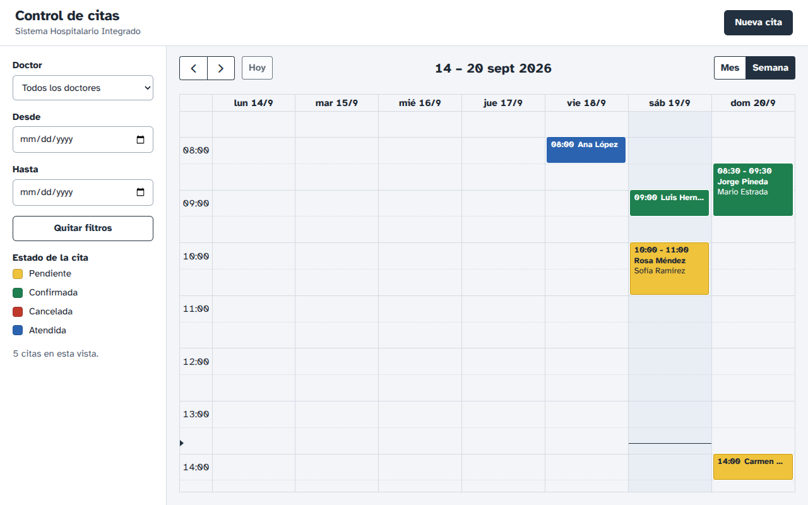
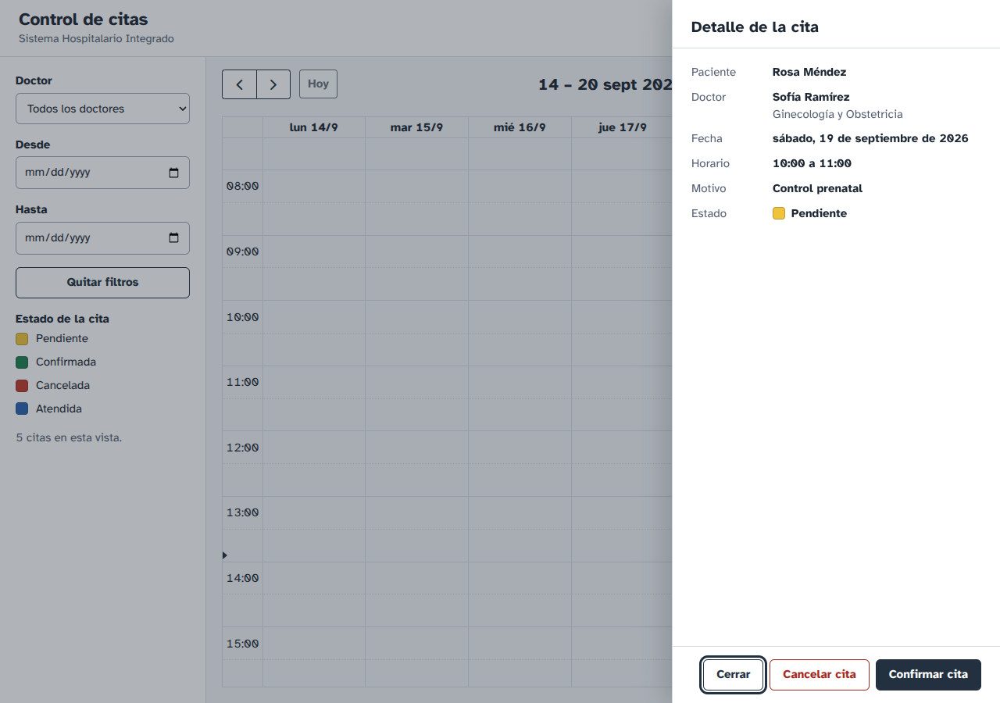
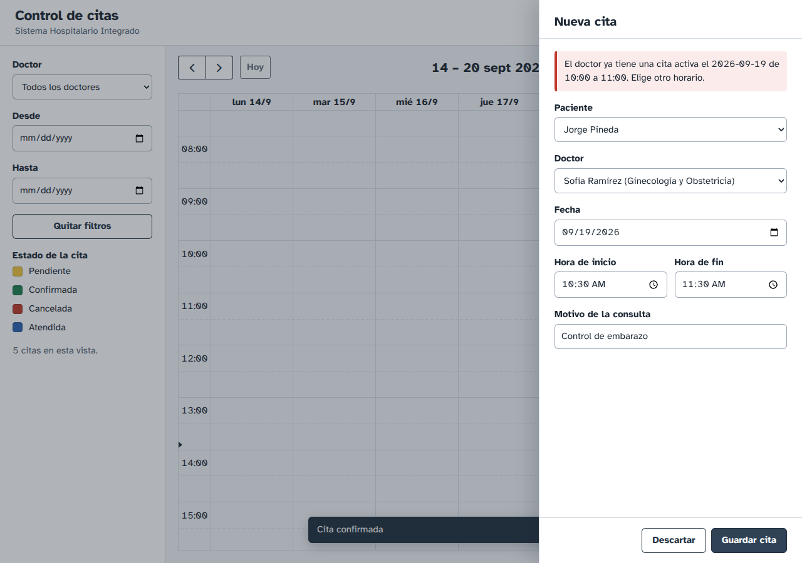
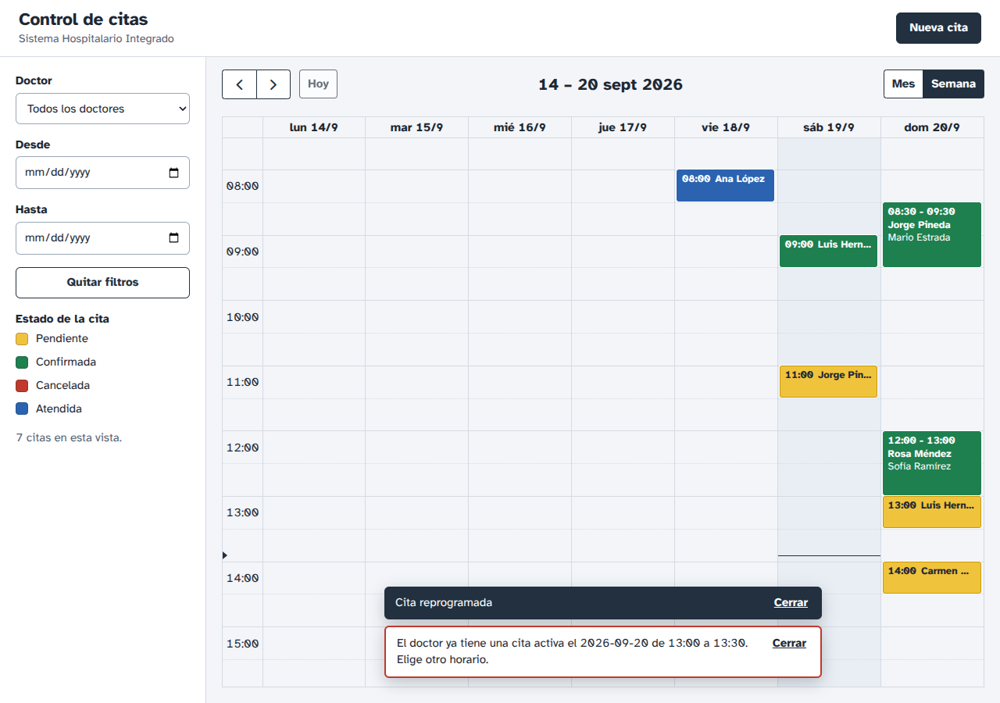
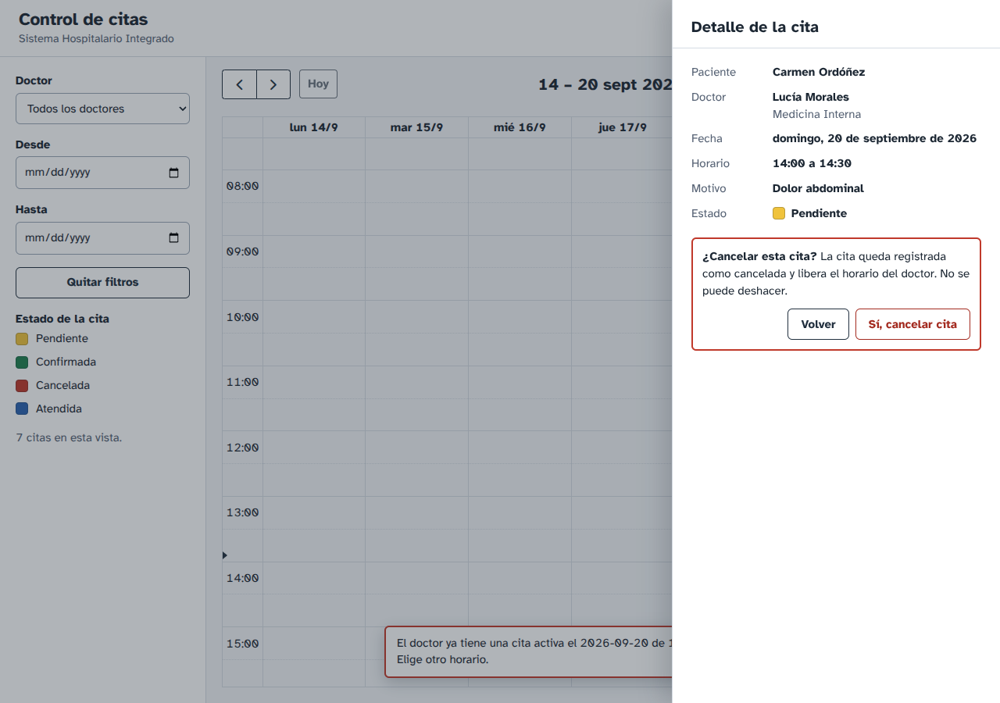
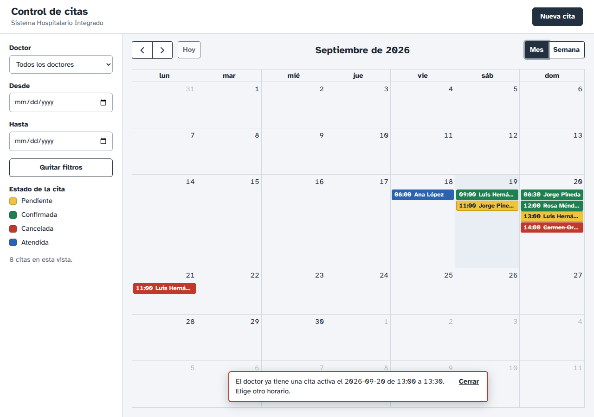
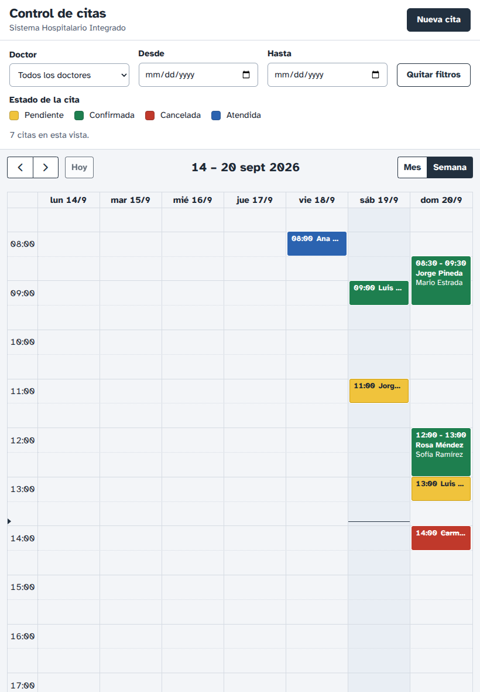

# Evidencia del módulo de control de citas

Generado el 2026-09-19 13:56 con `scripts/generar-evidencia.sh`.

## 1. MySQL en Docker

Sección pendiente: esta versión se generó en una máquina sin Docker. Ejecuta el script en un equipo con Docker para completarla.

## 2. Persistencia de los datos

Sección pendiente, por la misma razón.

## 3. Respuestas de la API

Se crea una cita el 2026-11-18 para el doctor 1, se prueba cada código de respuesta y al final se cancela para dejar libre el horario.

```
$ curl -X GET http://localhost:3000/api/doctores
[{"id":2,"nombre":"Andrés","apellido":"Castillo","especialidad":"Pediatría"},{"id":4,"nombre":"Mario","apellido":"Estrada","especialidad":"Cirugía General"},{"id":1,"nombre":"Lucía","apellido":"Morales","especialidad":"Medicina Interna"},{"id":3,"nombre":"Sofía","apellido":"Ramírez","especialidad":"Ginecología y Obstetricia"}]
HTTP 200

$ curl -X GET http://localhost:3000/api/pacientes
[{"id":2,"nombre":"Luis","apellido":"Hernández","dni":"1000000020101","telefono":"5555-0102"},{"id":1,"nombre":"Ana","apellido":"López","dni":"1000000010101","telefono":"5555-0101"},{"id":3,"nombre":"Rosa","apellido":"Méndez","dni":"1000000030101","telefono":"5555-0103"},{"id":5,"nombre":"Carmen","apellido":"Ordóñez","dni":"1000000050101","telefono":"5555-0105"},{"id":4,"nombre":"Jorge","apellido":"Pineda","dni":"1000000040101","telefono":"5555-0104"}]
HTTP 200

$ curl -X POST http://localhost:3000/api/citas -H 'Content-Type: application/json' -d '{"paciente_id":1,"doctor_id":1,"inicio":"2026-11-18T10:00","fin":"2026-11-18T10:30","motivo":"Cita de evidencia"}'
{"id":9,"paciente_id":1,"paciente_nombre":"Ana López","doctor_id":1,"doctor_nombre":"Lucía Morales","doctor_especialidad":"Medicina Interna","inicio":"2026-11-18T10:00:00","fin":"2026-11-18T10:30:00","motivo":"Cita de evidencia","estado":"pendiente","transiciones_permitidas":["confirmada","cancelada"],"reprogramable":true,"creado_en":"2026-09-19 13:56:11","actualizado_en":"2026-09-19 13:56:11"}
HTTP 201

$ curl -X GET http://localhost:3000/api/citas/9
{"id":9,"paciente_id":1,"paciente_nombre":"Ana López","doctor_id":1,"doctor_nombre":"Lucía Morales","doctor_especialidad":"Medicina Interna","inicio":"2026-11-18T10:00:00","fin":"2026-11-18T10:30:00","motivo":"Cita de evidencia","estado":"pendiente","transiciones_permitidas":["confirmada","cancelada"],"reprogramable":true,"creado_en":"2026-09-19 13:56:11","actualizado_en":"2026-09-19 13:56:11"}
HTTP 200

$ curl -X GET http://localhost:3000/api/citas?doctor_id=1&desde=2026-11-18&hasta=2026-11-18
[{"id":9,"paciente_id":1,"paciente_nombre":"Ana López","doctor_id":1,"doctor_nombre":"Lucía Morales","doctor_especialidad":"Medicina Interna","inicio":"2026-11-18T10:00:00","fin":"2026-11-18T10:30:00","motivo":"Cita de evidencia","estado":"pendiente","transiciones_permitidas":["confirmada","cancelada"],"reprogramable":true,"creado_en":"2026-09-19 13:56:11","actualizado_en":"2026-09-19 13:56:11"},{"id":7,"paciente_id":1,"paciente_nombre":"Ana López","doctor_id":1,"doctor_nombre":"Lucía Morales","doctor_especialidad":"Medicina Interna","inicio":"2026-11-18T14:00:00","fin":"2026-11-18T14:30:00","motivo":"Cita de evidencia","estado":"cancelada","transiciones_permitidas":[],"reprogramable":false,"creado_en":"2026-09-19 13:56:04","actualizado_en":"2026-09-19 13:56:04"}]
HTTP 200

# 409: choque de horario con el mismo doctor
$ curl -X POST http://localhost:3000/api/citas -H 'Content-Type: application/json' -d '{"paciente_id":2,"doctor_id":1,"inicio":"2026-11-18T10:15","fin":"2026-11-18T10:45","motivo":"Debe chocar"}'
{"codigo":"CONFLICTO_HORARIO","mensaje":"El doctor ya tiene una cita activa el 2026-11-18 de 10:00 a 10:30. Elige otro horario.","detalles":[{"cita_id":9,"inicio":"2026-11-18T10:00:00","fin":"2026-11-18T10:30:00"}]}
HTTP 409

# Mismo horario con otro doctor: se permite
$ curl -X POST http://localhost:3000/api/citas -H 'Content-Type: application/json' -d '{"paciente_id":2,"doctor_id":2,"inicio":"2026-11-18T10:00","fin":"2026-11-18T10:30","motivo":"Otro doctor"}'
{"id":10,"paciente_id":2,"paciente_nombre":"Luis Hernández","doctor_id":2,"doctor_nombre":"Andrés Castillo","doctor_especialidad":"Pediatría","inicio":"2026-11-18T10:00:00","fin":"2026-11-18T10:30:00","motivo":"Otro doctor","estado":"pendiente","transiciones_permitidas":["confirmada","cancelada"],"reprogramable":true,"creado_en":"2026-09-19 13:56:11","actualizado_en":"2026-09-19 13:56:11"}
HTTP 201

# 400: datos inválidos
$ curl -X POST http://localhost:3000/api/citas -H 'Content-Type: application/json' -d '{"paciente_id":1,"doctor_id":1,"inicio":"2026-11-18T11:00","fin":"2026-11-18T10:00"}'
{"codigo":"DATOS_INVALIDOS","mensaje":"Los datos enviados no son válidos.","detalles":["fin debe ser posterior a inicio.","motivo es obligatorio."]}
HTTP 400

# 400: paciente que no existe
$ curl -X POST http://localhost:3000/api/citas -H 'Content-Type: application/json' -d '{"paciente_id":9999,"doctor_id":1,"inicio":"2026-11-18T12:00","fin":"2026-11-18T12:30","motivo":"Paciente inexistente"}'
{"codigo":"DATOS_INVALIDOS","mensaje":"Los datos enviados no son válidos.","detalles":["El paciente 9999 no existe."]}
HTTP 400

# 404: cita que no existe
$ curl -X GET http://localhost:3000/api/citas/999999
{"codigo":"NO_ENCONTRADO","mensaje":"La cita 999999 no existe."}
HTTP 404

# Reprogramar (PUT)
$ curl -X PUT http://localhost:3000/api/citas/9 -H 'Content-Type: application/json' -d '{"inicio":"2026-11-18T14:00","fin":"2026-11-18T14:30"}'
{"id":9,"paciente_id":1,"paciente_nombre":"Ana López","doctor_id":1,"doctor_nombre":"Lucía Morales","doctor_especialidad":"Medicina Interna","inicio":"2026-11-18T14:00:00","fin":"2026-11-18T14:30:00","motivo":"Cita de evidencia","estado":"pendiente","transiciones_permitidas":["confirmada","cancelada"],"reprogramable":true,"creado_en":"2026-09-19 13:56:11","actualizado_en":"2026-09-19 13:56:11"}
HTTP 200

# 400: pendiente no puede pasar directo a atendida
$ curl -X PATCH http://localhost:3000/api/citas/9/estado -H 'Content-Type: application/json' -d '{"estado":"atendida"}'
{"codigo":"DATOS_INVALIDOS","mensaje":"Los datos enviados no son válidos.","detalles":["No se puede cambiar la cita de pendiente a atendida. Desde pendiente solo se puede pasar a: confirmada, cancelada."]}
HTTP 400

# Cambios de estado (PATCH)
$ curl -X PATCH http://localhost:3000/api/citas/9/estado -H 'Content-Type: application/json' -d '{"estado":"confirmada"}'
{"id":9,"paciente_id":1,"paciente_nombre":"Ana López","doctor_id":1,"doctor_nombre":"Lucía Morales","doctor_especialidad":"Medicina Interna","inicio":"2026-11-18T14:00:00","fin":"2026-11-18T14:30:00","motivo":"Cita de evidencia","estado":"confirmada","transiciones_permitidas":["atendida","cancelada"],"reprogramable":true,"creado_en":"2026-09-19 13:56:11","actualizado_en":"2026-09-19 13:56:11"}
HTTP 200

$ curl -X PATCH http://localhost:3000/api/citas/9/estado -H 'Content-Type: application/json' -d '{"estado":"cancelada"}'
{"id":9,"paciente_id":1,"paciente_nombre":"Ana López","doctor_id":1,"doctor_nombre":"Lucía Morales","doctor_especialidad":"Medicina Interna","inicio":"2026-11-18T14:00:00","fin":"2026-11-18T14:30:00","motivo":"Cita de evidencia","estado":"cancelada","transiciones_permitidas":[],"reprogramable":false,"creado_en":"2026-09-19 13:56:11","actualizado_en":"2026-09-19 13:56:11"}
HTTP 200

# 400: una cita cancelada ya no cambia
$ curl -X PATCH http://localhost:3000/api/citas/9/estado -H 'Content-Type: application/json' -d '{"estado":"confirmada"}'
{"codigo":"DATOS_INVALIDOS","mensaje":"Los datos enviados no son válidos.","detalles":["No se puede cambiar la cita de cancelada a confirmada. Una cita cancelada ya no cambia de estado."]}
HTTP 400

# El registro cancelado sigue existiendo (no se borra)
$ curl -X GET http://localhost:3000/api/citas/9
{"id":9,"paciente_id":1,"paciente_nombre":"Ana López","doctor_id":1,"doctor_nombre":"Lucía Morales","doctor_especialidad":"Medicina Interna","inicio":"2026-11-18T14:00:00","fin":"2026-11-18T14:30:00","motivo":"Cita de evidencia","estado":"cancelada","transiciones_permitidas":[],"reprogramable":false,"creado_en":"2026-09-19 13:56:11","actualizado_en":"2026-09-19 13:56:11"}
HTTP 200

$ curl -X PATCH http://localhost:3000/api/citas/10/estado -H 'Content-Type: application/json' -d '{"estado":"cancelada"}'
{"id":10,"paciente_id":2,"paciente_nombre":"Luis Hernández","doctor_id":2,"doctor_nombre":"Andrés Castillo","doctor_especialidad":"Pediatría","inicio":"2026-11-18T10:00:00","fin":"2026-11-18T10:30:00","motivo":"Otro doctor","estado":"cancelada","transiciones_permitidas":[],"reprogramable":false,"creado_en":"2026-09-19 13:56:11","actualizado_en":"2026-09-19 13:56:11"}
HTTP 200

```

## 4. Historial de Git

```
$ git branch -a
  feature/api-rest-citas
  feature/docker-mysql-schema
* feature/evidencia
  feature/fullcalendar-ui
  feature/validacion-conflictos-estados
  main

$ git log --graph --all --oneline
* e92829a feat(evidencia): script que genera EVIDENCIA.md con docker, API y git (RQNF-08)
*   bf2cf7a Merge pull request #4 de feature/fullcalendar-ui
|\  
| * 9c65e71 feat(ui): calendario con crear cita, detalle, drag & drop y colores por estado (RQF-02, RQF-04, RQF-06, RQF-09, RQF-10)
| * d244a64 feat(ui): página, estilos y cliente de la API servidos por Express (RQNF-06)
|/  
*   29182bd Merge pull request #3 de feature/validacion-conflictos-estados
|\  
| * c3e9f51 feat(citas): transiciones de estado y cancelación sin borrar el registro (RQF-05, RQNF-03)
| * 3da1089 feat(citas): rechazo de doble reserva con 409, validado en el servidor (RQF-03, RQNF-07)
|/  
*   6b86f2a Merge pull request #2 de feature/api-rest-citas
|\  
| * ee3a74f feat(api): endpoints de citas con validación de entrada (RQF-01, RQF-06, RQF-07, RQF-08, RQNF-03)
| * b127032 feat(api): estructura por capas y lectura de doctores y pacientes (RQF-07, RQNF-04)
|/  
*   8f72477 Merge pull request #1 de feature/docker-mysql-schema
|\  
| * d6b1e75 feat(db): esquema de pacientes, doctores y citas con datos semilla (RQNF-01)
| * 007a87d feat(docker): docker-compose con MySQL 8, volumen persistente y healthcheck (RQNF-01, RQNF-02)
|/  
* 00743bb chore: estructura inicial del repositorio (RQNF-05)

$ git log main --merges --oneline
bf2cf7a Merge pull request #4 de feature/fullcalendar-ui
29182bd Merge pull request #3 de feature/validacion-conflictos-estados
6b86f2a Merge pull request #2 de feature/api-rest-citas
8f72477 Merge pull request #1 de feature/docker-mysql-schema

```

## 5. Capturas de la interfaz















